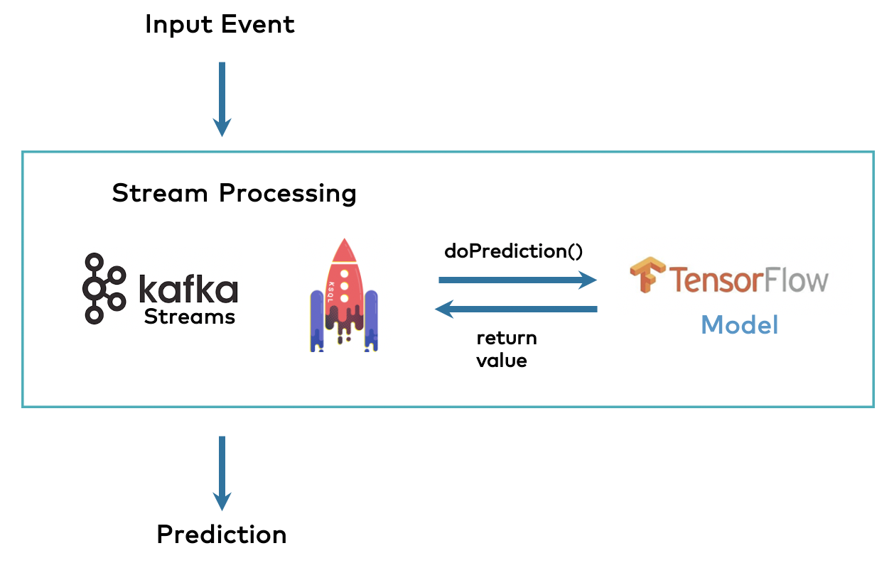

# Demo

[Streaming Deep Learning Model Inference - Screencast](https://drive.google.com/file/d/1P3WVJAeRYxSaPBNwTarTomH39XPpdOaF/view?usp=sharing)

---

# Setup Instructions

## Kafka Setup
- https://www.geeksforgeeks.org/how-to-install-and-run-apache-kafka-on-windows/
- https://www.youtube.com/watch?v=EUzH9khPYgs
- Note that Kafka is setup locally on my personal laptop

## Pubsub Setup
- https://cloud.google.com/pubsub/docs/create-topic-gcloud
- https://cloud.google.com/pubsub/docs/create-topic-console
- Credential file must be placed at root
- Note that Pubsub is setup on the cloud on my personal GCP account

# Model
- CNN based mode on on Fashion MNIST Dataset.
- To train/update model, update the `fashion_mnist_model.ipynb` notebook.

# Requirements
- Python3 needs to be installed in the system
- Requirements must be installed via `requirements.txt` provided

  ```
  pip install -r requirements.txt
  ```

# Kafka Setup - Local
- Run zookeeper service

  ```
  zookeeper-server-start.bat ..\..\config\zookeeper.properties
  ```

- Run Kafka server

  ```
  kafka-server-start.bat ..\..\config\server.properties
  ```

# Flask API

Server runs on `localhost:5000` and produces messages after submitting the form

  ```
  py app.py
  ```

## Publisher Endpoints

### Kafka

- To publish a message to kafka message queue

  ```
  http://localhost:5000/kafka/push-to-consumer?start_idx=0&end_idx=1
  ```

### Pubsub

- To publish a message to pubsub message queue

  ```
  http://localhost:5000/pubsub/push-to-consumer?start_idx=0&end_idx=1
  ```

Here, start_idx and end_idx represent the test set index for fashion MNIST dataset.

The above endpoints are called when user submits the form displayed on root url.

## Consumers

### Kafka Consumer
- Consumer with model inference lives here

  ```
  py consumer.py
  ```

- Output is the list of predicted class labels on the test set based on the start_idx and end_idx provided
- Output is printed to consumer console

### Google Pubsub Subscriber
- Subscriber with model inference lives here

  ```
  py subscriber.py
  ```

- Output is the list of predicted class labels on the test set based on the start_idx and end_idx provided
- Output is printed to subscriber console

# Architecture

- Embedded Architecture for extremely fast inference time


# Next Steps

- Move the various configurations to a separate config.json file
- Deploy the kafka queue implementation onto cloud
- Try different deployment architectures to see which one fits the best
- Move common model loading code to a separate class/file and call it in the different consumers
- Improve model accuracy by changing the model architecture and data augmentation
- Instead of passing indexes, can give option to upload test image directly to the user
- Push the inference to a database

# References
- https://cloud.google.com/pubsub/docs/emulator
- https://cloud.google.com/pubsub/docs/create-topic-console
- https://cloud.google.com/pubsub/docs/publisher
- https://github.com/googleapis/python-pubsub/blob/main/samples/snippets/subscriber.py
- https://www.kai-waehner.de/blog/2020/10/27/streaming-machine-learning-kafka-native-model-server-deployment-rpc-embedded-streams/
